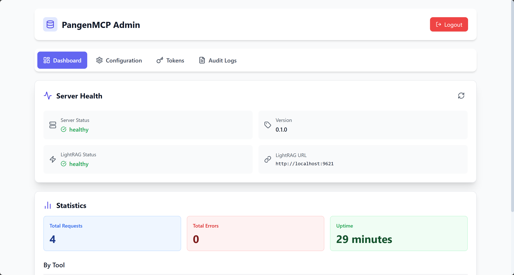

# pangenMCP - LightRAG MCP 服务器

基于 Rust 的 MCP (Model Context Protocol) 服务器，为 AI Agent 提供访问 LightRAG 知识库的标准化接口。

## 功能特性

- 🔍 **语义查询**：支持 4 种查询模式（naive/local/global/hybrid）
- 📝 **文档管理**：插入文档、清空知识库
- 🔐 **权限控制**：Bearer Token + 9 个 scope 权限
- 🔥 **配置热重载**：修改 config.toml 自动生效
- 🎛️ **管理界面**：Web UI（Alpine.js + Tailwind CSS）
- 📈 **监控指标**：Prometheus `/metrics` 端点
- 📊 **审计日志**：记录所有操作

## Quick Start

### 前置要求

- Rust 1.70+
- LightRAG 服务器运行在 `http://localhost:9621`

### 5 分钟启动

```bash
# 1. 复制配置文件
cp config.example.toml config.toml

# 2. 生成管理员 token
openssl rand -hex 32

# 3. 编辑 config.toml，替换 admin token
# 将生成的 token 填入 [[auth.tokens]] 的 token 字段

# 4. 启动服务器
cargo run

# 5. 访问 http://localhost:8080，输入 token 登录
```

### 配置说明

编辑 `config.toml`：

```toml
[lightrag]
url = "http://localhost:9621"  # LightRAG 地址

[[auth.tokens]]
name = "Admin"
token = "your-generated-token-here"
scopes = [
    "rag:read", "rag:write", "rag:admin",
    "stats:read", "config:read", "config:write",
    "token:read", "token:write", "audit:read"
]
```

## 管理界面


访问 `http://localhost:8080`：

- **Dashboard**：健康状态、请求统计
- **Configuration**：查看和修改配置
- **Tokens**：管理访问 token
- **Audit Logs**：查看审计日志


## 配置热重载

修改 `config.toml` 后自动生效（1-2 秒），无需重启：

| 配置项 | 说明 |
|--------|------|
| `auth.tokens` | Token 列表 |
| `defaults.*` | 查询默认参数 |

**不可热重载**（需重启）：`server.host/port`、`lightrag.url`、`mcp.*`

## 权限 Scope

| Scope | 说明 | 适用端点/工具 |
|-------|------|--------------|
| `rag:read` | 查询权限 | rag_query |
| `rag:write` | 写入权限 | rag_insert, rag_clear |
| `rag:admin` | 管理权限 | rag_health |
| `stats:read` | 统计查看 | GET /api/stats |
| `config:read` | 配置查看 | GET /api/config |
| `config:write` | 配置修改 | PATCH /api/config |
| `token:read` | Token 查看 | GET /api/tokens |
| `token:write` | Token 管理 | POST/DELETE /api/tokens |
| `audit:read` | 日志查看 | GET /api/audit/logs |

## API 端点

### 管理 API

| 方法 | 路径 | 权限 | 说明 |
|------|------|------|------|
| GET | `/api/health` | 无 | 健康状态 |
| GET | `/api/stats` | `stats:read` | 请求统计 |
| GET | `/api/config` | `config:read` | 查看配置 |
| PATCH | `/api/config` | `config:write` | 修改配置 |
| GET | `/api/tokens` | `token:read` | 列出 token |
| POST | `/api/tokens` | `token:write` | 创建 token |
| DELETE | `/api/tokens/:name` | `token:write` | 删除 token |
| GET | `/api/audit/logs` | `audit:read` | 审计日志 |

### MCP 端点

| 路径 | 说明 |
|------|------|
| `/mcp` | MCP Streamable HTTP 传输端点 |

### 监控端点

| 方法 | 路径 | 说明 |
|------|------|------|
| GET | `/metrics` | Prometheus 格式监控指标 |

详见 [docs/monitoring.md](docs/monitoring.md)。

## MCP 工具

### rag_query - 查询知识库

```json
{
  "query": "What is Rust?",
  "mode": "hybrid",
  "top_k": 60
}
```

**查询模式**：`hybrid`（推荐）、`local`、`global`、`naive`

### rag_insert - 插入文档

```json
{
  "text": "Your document content here",
  "description": "Optional description"
}
```

### rag_clear - 清空知识库

清空所有文档（需要 `rag:write` 权限）。

### rag_health - 健康检查

检查 LightRAG 服务器状态（需要 `rag:admin` 权限）。

## 使用示例

### Claude Code 配置

```bash
claude mcp add --transport http \
  ragMCP http://127.0.0.1:8080/mcp \
  --header "Authorization: Bearer <your-token>"
```

或在配置文件中：

```json
{
  "mcpServers": {
    "lightrag": {
      "url": "http://localhost:8080/mcp",
      "headers": {
        "Authorization": "Bearer your_token_here"
      }
    }
  }
}
```

### curl 测试

```bash
# 查询
curl -X POST http://localhost:8080/mcp \
  -H "Authorization: Bearer your_token" \
  -H "Content-Type: application/json" \
  -d '{"tool": "rag_query", "query": "What is Rust?"}'

# 插入文档
curl -X POST http://localhost:8080/mcp \
  -H "Authorization: Bearer your_token" \
  -H "Content-Type: application/json" \
  -d '{"tool": "rag_insert", "text": "Rust is a systems programming language."}'
```

## 开发

### 项目结构

```
src/
├── main.rs             # 程序入口
├── config.rs           # 配置加载
├── error.rs            # 错误类型
├── http/               # HTTP 服务器和认证中间件
├── mcp/                # MCP 工具实现
├── rag/                # LightRAG 客户端
├── auth/               # 认证和审计
├── stats/              # 统计收集
├── api/                # 管理 API
└── metrics/            # Prometheus 指标
```

### 运行测试

```bash
# 全部测试（144 个：80 单元 + 64 集成）
cargo test

# 仅单元测试
cargo test --lib

# 仅集成测试
cargo test --test integration_test

# 代码格式化
cargo fmt
cargo clippy
```

## 监控

Prometheus 指标端点：`GET /metrics`

主要指标：
- `mcp_requests_total` - 请求总数（按工具、用户、状态）
- `mcp_request_duration_ms` - 请求耗时直方图
- `lightrag_healthy` - LightRAG 健康状态
- `mcp_auth_failures_total` - 认证失败次数

详见 [docs/monitoring.md](docs/monitoring.md)。

## 文档

- [架构设计](docs/DESIGN.md) - 系统设计和技术选型
- [开发状态](docs/STATUS.md) - 实现状态和测试覆盖
- [开发计划](tasks/README.md) - 任务列表和里程碑
- [监控指南](docs/monitoring.md) - Prometheus 集成
- [AI 协作规范](CLAUDE.md) - 开发原则和工作流

## 许可证

MIT
